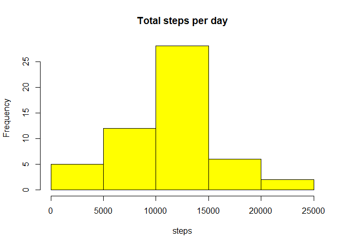
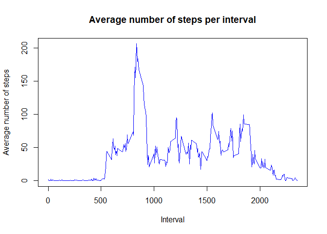
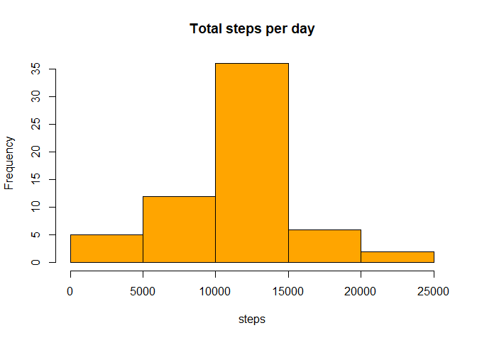
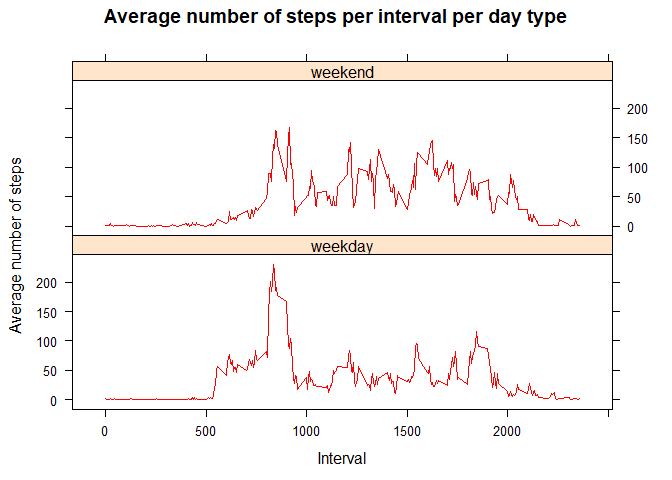

## Loading and preprocessing the data

1. Load the data


```r
unzip("./activity.zip")
activity<-read.csv("./activity.csv")
```
2. Process/transform the data (if necessary) into a format suitable for your analysis


```r
head(activity)
```

```
##   steps       date interval
## 1    NA 2012-10-01        0
## 2    NA 2012-10-01        5
## 3    NA 2012-10-01       10
## 4    NA 2012-10-01       15
## 5    NA 2012-10-01       20
## 6    NA 2012-10-01       25
```

```r
str(activity)
```

```
## 'data.frame':	17568 obs. of  3 variables:
##  $ steps   : int  NA NA NA NA NA NA NA NA NA NA ...
##  $ date    : chr  "2012-10-01" "2012-10-01" "2012-10-01" "2012-10-01" ...
##  $ interval: int  0 5 10 15 20 25 30 35 40 45 ...
```

```r
summary(activity)
```

```
##      steps            date              interval     
##  Min.   :  0.00   Length:17568       Min.   :   0.0  
##  1st Qu.:  0.00   Class :character   1st Qu.: 588.8  
##  Median :  0.00   Mode  :character   Median :1177.5  
##  Mean   : 37.38                      Mean   :1177.5  
##  3rd Qu.: 12.00                      3rd Qu.:1766.2  
##  Max.   :806.00                      Max.   :2355.0  
##  NA's   :2304
```

```r
activity$date <- as.Date(activity$date,"%Y-%m-%d")
str(activity)
```

```
## 'data.frame':	17568 obs. of  3 variables:
##  $ steps   : int  NA NA NA NA NA NA NA NA NA NA ...
##  $ date    : Date, format: "2012-10-01" "2012-10-01" ...
##  $ interval: int  0 5 10 15 20 25 30 35 40 45 ...
```

## What is mean total number of steps taken per day?

1. Calculate the total number of steps taken per day

```r
total_steps<-aggregate(steps~date,data=activity,FUN=sum,na.rm=TRUE)
```
2. Make a histogram of the total number of steps taken each day

```r
hist(total_steps$steps, breaks=5, col="yellow", border=NULL, xlab="steps", main="Total steps per day")
```

<!-- -->

3. Calculate and report the mean and median of the total number of steps taken per day

```r
mean_steps<-mean(total_steps$steps)
```

```r
median_steps<-median(total_steps$steps)
```
- The **mean** of the total number of steps taken per day is: 
    10766 steps.
- The **median** of the total number of steps taken per day is: 
    10765 steps.
    

    
## What is the average daily activity pattern?

1. Make a time series plot of the 5-minute interval (x-axis) and the average number of steps taken, averaged across all days (y-axis)


```r
mean_steps_interval<-aggregate(steps~interval,data=activity,mean,na.rm=TRUE)
plot(steps~interval,data=mean_steps_interval,type="l", col="blue", xlab="Interval",ylab="Average number of steps", main="Average number of steps per interval")
```

<!-- -->

2. Which 5-minute interval, on average across all the days in the dataset, contains the maximum number of steps?


```r
max_mean<-max(mean_steps_interval$steps)
max_interval<-mean_steps_interval[mean_steps_interval$steps==max_mean,1]
```

- The 5-minute interval on average of all days that contains the maximum number of steps is the 835 interval.


## Imputing missing values

1. Calculate and report the total number of missing values in the dataset (i.e. the total number of rows with NAs)


```r
na_values<-sum(is.na(activity$steps))
```

- Total 2304 rows have NAs values.

2. Devise a strategy for filling in all of the missing values in the dataset. 

- The missing values will be filled using the mean value for each interval.

3. Create a new dataset that is equal to the original dataset but with the missing data filled in.


```r
activity_2<-activity
for(i in 1:nrow(activity_2)){
    if(is.na(activity_2[i,]$steps)){
	interval_na<-activity_2[i,]$interval
        activity_2[i,]$steps<-mean_steps_interval[mean_steps_interval$interval==interval_na,]$steps
    }
}
head(activity_2)
```

```
##       steps       date interval
## 1 1.7169811 2012-10-01        0
## 2 0.3396226 2012-10-01        5
## 3 0.1320755 2012-10-01       10
## 4 0.1509434 2012-10-01       15
## 5 0.0754717 2012-10-01       20
## 6 2.0943396 2012-10-01       25
```


4. Make a histogram of the total number of steps taken each day and calculate and report the mean and median total number of steps taken per day. Do these values differ from the estimates from the first part of the assignment? What is the impact of imputing missing data on the estimates of the total daily number of steps?


```r
total_steps_2<-aggregate(steps~date,data=activity_2,sum)
hist(total_steps_2$steps, breaks=5, col="orange", border=NULL, xlab="steps", main="Total steps per day")
```

<!-- -->

```r
mean_steps_2<-mean(total_steps_2$steps)
median_steps_2<-median(total_steps_2$steps)
```
- The **mean** of the total number of steps taken per day is: 
    10766 steps.
- The **median** of the total number of steps taken per day is: 
    10766 steps.
- The **mean** value is the **same** as before.
- The **median** value is a little bit different.

## Are there differences in activity patterns between weekdays and weekends?

1. Create a new factor variable in the dataset with two levels – “weekday” and “weekend” indicating whether a given date is a weekday or weekend day.

```r
activity_2$day<-weekdays(activity_2$date)
activity_2$type_day<-ifelse(activity_2$day %in% c("sábado", "domingo"), "weekend", "weekday")
```

2. Make a panel plot containing a time series plot of the 5-minute interval (x-axis) and the average number of steps taken, averaged across all weekday days or weekend days (y-axis). 


```r
library(lattice)
mean_steps_interval_2<-aggregate(steps~interval+type_day,activity_2,mean)
xyplot(steps~interval|factor(type_day),data=mean_steps_interval_2, type="l",col="red",layout=c(1,2),xlab="Interval", ylab="Average number of steps", main="Average number of steps per interval per day type")
```

<!-- -->
